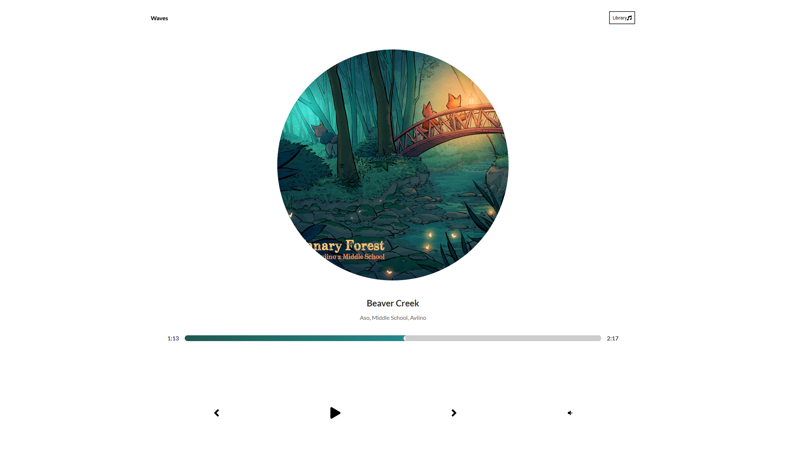
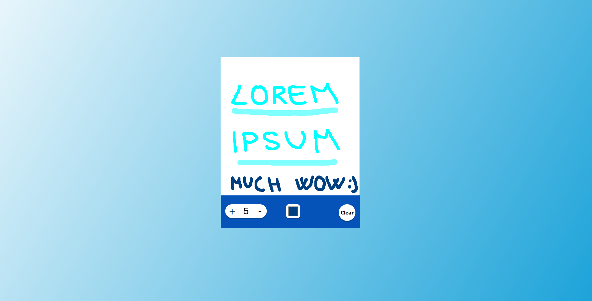
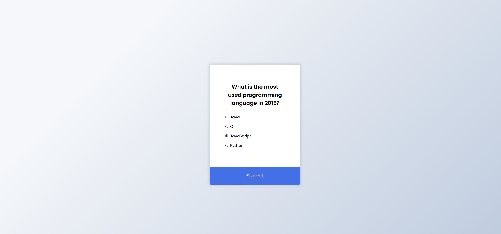
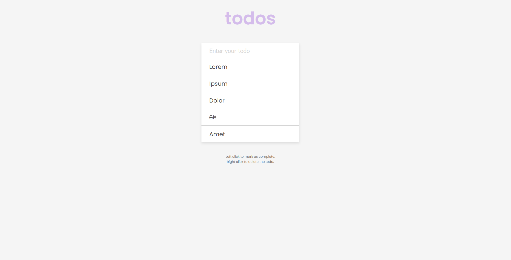
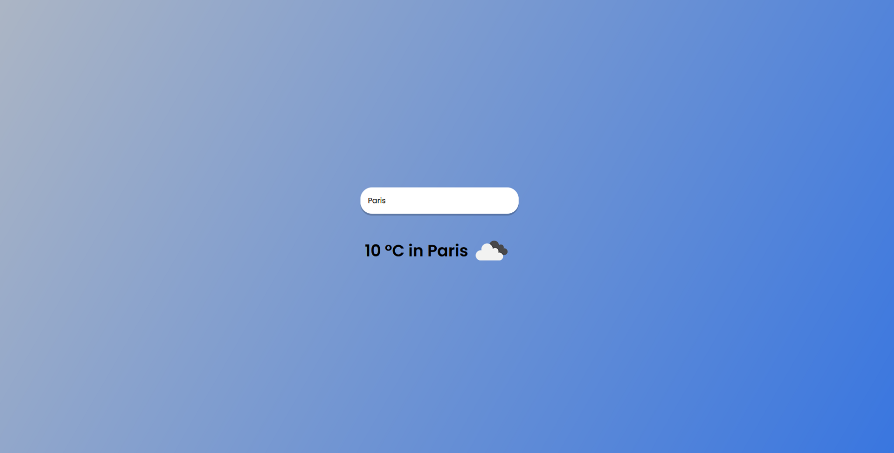

 APP NAME: Music App 
 CATEGORY:  Frontend Software Engineering  
 TECHNOLOGICAL STACK: Vanilla Javascript + API 
 LIVE DEMO: NO  
 DESIGN: INSPIRED BY DEV ED (below)  
 END RESULT (GOAL):
 
 
 
 APP NAME: Countdown Timer To Christmas 
 CATEGORY:  Frontend Software Engineering  
 TECHNOLOGICAL STACK: Vanilla Javascript + Date 
 LIVE DEMO: NO  
 DESIGN: https://uidesigndaily.com/posts/sketch-countdown-timer-day-876  
 END RESULT:
 
 
 APP NAME: Drawing App  
 CATEGORY:  Frontend Software Engineering  
 TECHNOLOGICAL STACK: Vanilla Javascript + Canvas 
 LIVE DEMO: NO  
 DESIGN: Own  
 END RESULT:
 

 APP NAME: Movie App  
 CATEGORY:  Frontend Software Engineering  
 TECHNOLOGICAL STACK: Vanilla Javascript + API 
 LIVE DEMO: NO  
 DESIGN: https://uidesigndaily.com/posts/photoshop-movie-app-mobile-day-193  
 END RESULT:
 

 APP NAME: Quiz App 
 CATEGORY:  Frontend Software Engineering  
 TECHNOLOGICAL STACK: Vanilla Javascript 
 LIVE DEMO: NO  
 DESIGN: https://uidesigndaily.com/posts/sketch-questionnaire-choice-submit-day-924  
 END RESULT:
 

 APP NAME: Todo App + Local Storage 
 CATEGORY:  Frontend Software Engineering  
 TECHNOLOGICAL STACK: Vanilla Javascript 
 LIVE DEMO: NO  
 DESIGN: http://todomvc.com/examples/vanillajs/  
 END RESULT:
 
 
 APP NAME: Weather App  
 CATEGORY:  Frontend Software Engineering  
 TECHNOLOGICAL STACK: Vanilla Javascript + API 
 LIVE DEMO: NO  
 DESIGN: Own  
 END RESULT:
 
